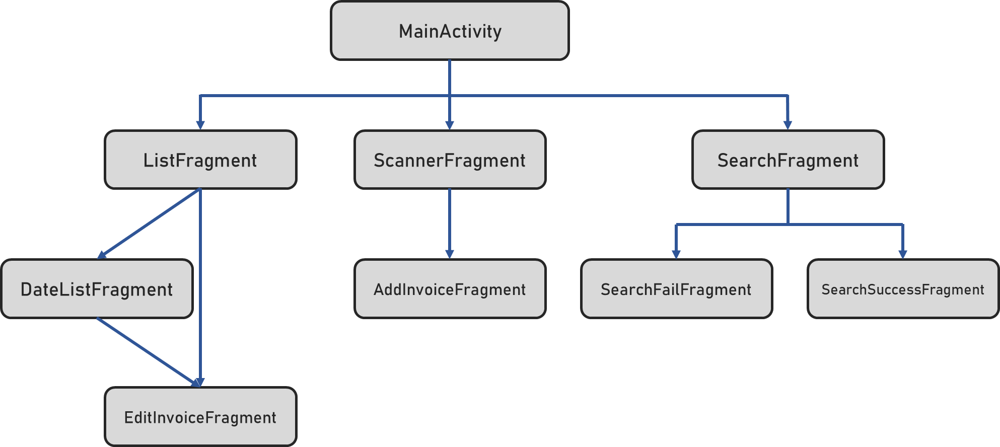
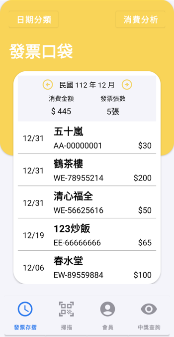
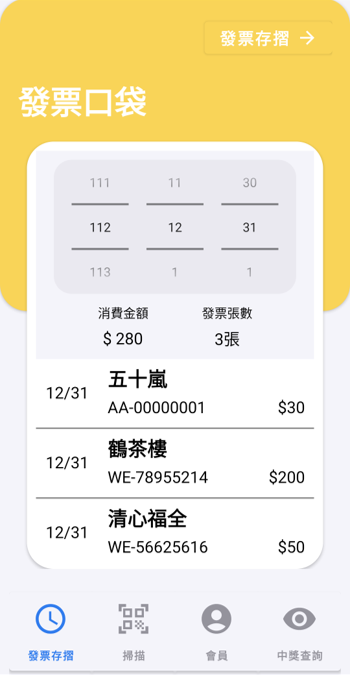
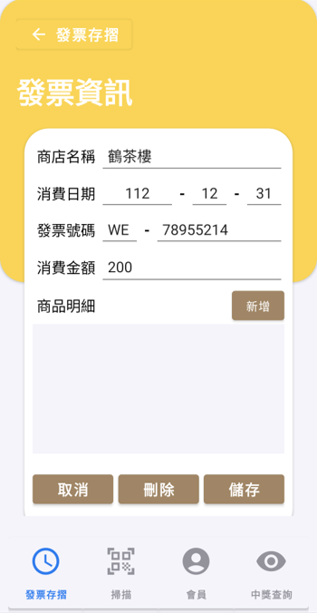
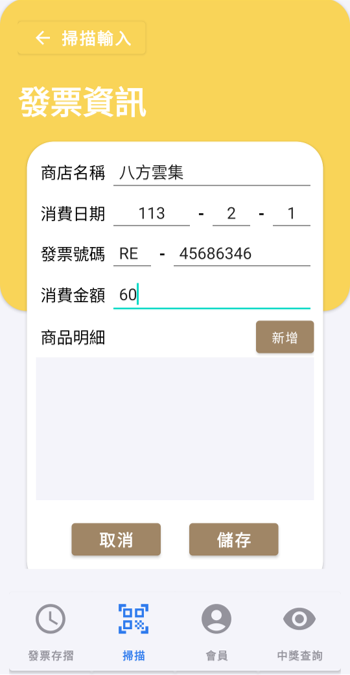
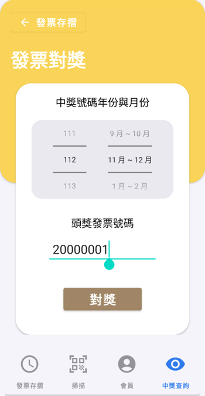
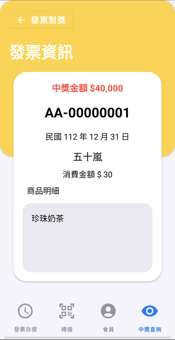
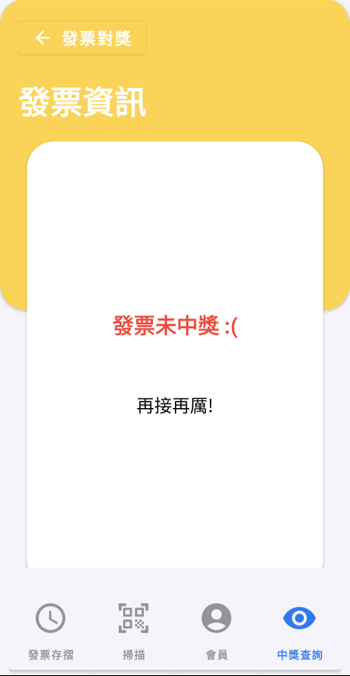
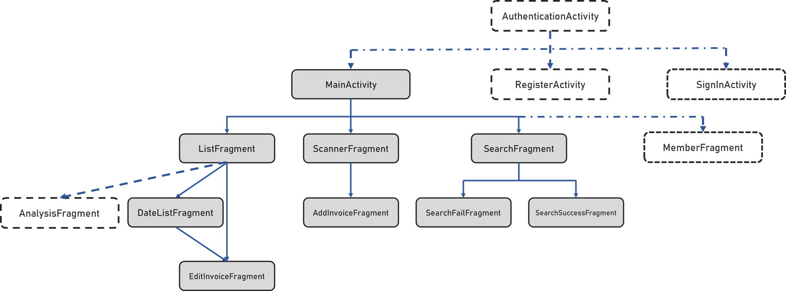

# 發票 App 練習
## App 頁面架構
<p align="center"></p>

## 一些功能需求 & 解決工具或方法
1. 已儲存的發票，在重新開機手機後，仍須存在
  * 解法 : 使用內建的 SQLite 資料庫，並配合 `SQLiteOpenHelper()` 進行資料庫存取操作
2. 有些發票資料可以為空，有些則不能
  * 解法 : 在資料庫建立 Table 時，將不能為空的欄位設為 `NOT NULL`，並且在 Kotlin 程式碼中盡量顧及到變數為空的狀況
3. 需要達到多個頁面跳轉
  * 解法 : 採用多個 Fragment 配合 FragmentManager 以達成切換效果
## 專案細節
### 主頁面 (`MainActivity.kt`)
* 作為四大功能頁面的基底 Activity
* 下方的選擇欄使用了 Material Button 中的 ToggleButton
<p align="center"></p>

### 月份列表頁面 (`ListFragment.kt`)
* 此頁面是以年分與月份去抓取對應的發票資料
* 中間的左右兩個箭頭會改變當前紀錄的年份(`currentYear`)與月份(`currentMonth`)，改變後其下方的 TextView 與更下方的 RecyclerView 皆會更新
* 資料庫方面，RecyclerView 中顯示的發票資料採用以下 query 進行資料抓取
  ```sql
  SELECT * FROM $TABLE_NAME 
      WHERE $COLUMN_YEAR = $searchYear AND $COLUMN_MONTH = $searchMonth
      ORDER BY $COLUMN_YEAR DESC, $COLUMN_MONTH DESC, $COLUMN_DAY DESC;
  ```
* 在 RecylcerView 中，每個物件皆有設置 `onItemClick()` 點擊事件，可透過其 unique ID 導航至編輯資料頁面。
<p align="center"></p>

### 日期列表頁面 (`DateListFragment.kt`)
* 此頁面是以年分、月份與日期去抓取對應的發票資料
* 中間的三個 Number Picker 可以讓使用者搜尋欲查詢的日期，改變後一樣修改當前紀錄的年份(`currentYear`)、月份(`currentMonth`)與日期(`currentDay`)，改變後其下方的 TextView 與更下方的 RecyclerView 皆會更新
* 資料庫方面，RecyclerView 中顯示的發票資料採用以下 query 進行資料抓取
  ```sql
  SELECT * FROM $TABLE_NAME 
      WHERE $COLUMN_YEAR = $searchYear AND $COLUMN_MONTH = $searchMonth AND $COLUMN_DAY = $searchDay
      ORDER BY $COLUMN_YEAR DESC, $COLUMN_MONTH DESC, $COLUMN_DAY DESC;
  ```
* 在 RecylcerView 中，每個物件一樣有設置 `onItemClick()` 點擊事件，可透過其 unique ID 導航至編輯資料頁面。
* 阻礙 : Number Picker 由於好像無法調整成「只顯示當前數值，並隱藏上下值」的效果，因此無法完全模仿題目要求的樣子
<p align="center"></p>

### 編輯發票資料頁面 (`EditInvoiceFragment.kt`)
* 於該頁面中，使用者可以針對該筆發票資料進行修改或刪除的動作
* 資料庫方面，用該發票的 unique ID 從資料庫找出對應的發票資料，採用 query 如下 : 
  ```sql
  SELECT * FROM $TABLE_NAME WHERE $COLUMN_ID = $invoiceId;
  ```
* 若使用者點擊「更新」按鈕，則會先確定所有資料格式是否正確，後續再使用該發票的 unique ID 更新資料庫中對應的發票資料
  * 更新時的資料庫查詢方式如下 :
    ```kotlin
    val values = ContentValues().apply {
            put(COLUMN_INVOICENUMBER, invoice.invoiceNumber)
            put(COLUMN_YEAR, invoice.year)
            // ... 打包資料
        }
    val whereClause = "$COLUMN_ID = ?"
    val whereArgs = arrayOf(invoice.id.toString())
    db.update(TABLE_NAME, values, whereClause, whereArgs)
    ```
* 若使用者點擊「刪除」按鈕，則會先向使用者詢問是否要刪除該資料，後續再使用該發票的 unique ID 從資料庫中刪除該發票資料
  * 刪除時的資料庫查詢方式如下 :
    ```kotlin
    val whereClause = "$COLUMN_ID = ?"
    val whereArgs = arrayOf(invoiceId.toString())
    db.delete(TABLE_NAME, whereClause, whereArgs)
    ```
<p align="center"></p>

### 相機掃描頁面 (`ScannerFragment`)
* 讓使用者可以使用手機相機直接進行拍照掃描
* 若有需要，可點擊右上按鈕改用手動輸入
<p align="center"></p>

### 手動輸入頁面 (`AddInvoiceFragment`)
* 於該頁面中，使用者可以直接手動新增發票資料
* 若使用者點擊「儲存」按鈕，則會先確定所有資料格式是否正確，後續再儲存進資料庫中
* 資料庫查詢方式如下 :
  ```kotlin
  val values = ContentValues().apply {
            put(COLUMN_INVOICENUMBER, invoice.invoiceNumber)
            put(COLUMN_YEAR, invoice.year)
            // ... 打包資料
        }
  writableDatabase.insert(TABLE_NAME, null, values)
  ```
<p align="center"></p>
  
### 發票對獎頁面 (`SearchFragment`)
* 於該頁面中，使用者可以調整對獎時間與自行填入頭獎發票號碼，以進行對獎
* 對獎時間使用 Number Picker 讓使用者自行調整
* 發票號碼的輸入欄也會檢查其是符合發票格式
* 資料庫方面，我使用 `CASE WHEN...` 與 `SUBSTRING()` 以抓取滿足不同中獎條件之發票，並記錄其中獎金額於 `prize_amount` 欄位中
  ```sql
  SELECT *,
      CASE
          WHEN SUBSTRING($COLUMN_INVOICENUMBER, 4) = "$code" THEN 200000
          WHEN SUBSTRING($COLUMN_INVOICENUMBER, 5) = SUBSTRING("$code", 2) THEN "40,000"
          WHEN SUBSTRING($COLUMN_INVOICENUMBER, 6) = SUBSTRING("$code", 3) THEN "10,000"
          WHEN SUBSTRING($COLUMN_INVOICENUMBER, 7) = SUBSTRING("$code", 4) THEN "4,000"
          WHEN SUBSTRING($COLUMN_INVOICENUMBER, 8) = SUBSTRING("$code", 5) THEN "1,000"
          WHEN SUBSTRING($COLUMN_INVOICENUMBER, 9) = SUBSTRING("$code", 6) THEN "200"
          ELSE "0"
      END AS prize_amount
  FROM $TABLE_NAME
  WHERE $COLUMN_YEAR = $searchYear AND ($COLUMN_MONTH = ${searchMonth?.first} OR $COLUMN_MONTH = ${searchMonth?.second})
  ORDER BY $COLUMN_YEAR DESC, $COLUMN_MONTH DESC, $COLUMN_DAY DESC
  ```
* 後續在使用 cursor 依序抓取資料時，判斷若 `prize_amount` 欄位為 0，代表該發票未中獎，即不會記錄起來
* 最後將中獎之發票資料匯集成 List 並回傳
<p align="center"></p>
  
### 成功中獎頁面 (`SearchSuccessFragment.kt`) & 並未中獎頁面 (`SearchFailFragment.kt`)
* 若發票對獎頁面收到之回傳 List 為空，代表無發票中獎，則會導航至並未中獎頁面
* 若發票對獎頁面收到之回傳 List 非空，代表有發票中獎，則會導航至成功中獎頁面
<p align="center"></p>
  
<p align="center"></p>

## 尚未完成的部分
### 基礎功能
1. Unit Test
2. Number Picker 大小調整
3. 於新增/編輯發票頁面中的新增明細功能
    * 使用 RecyclerView 顯示多個品項與其售價
    * 「新增」按鈕實做
4. 在發票對獎頁面，目前只能顯示單一中獎發票，後續須實作多個中獎發票之條列清單
5. 會員頁面 (`MemberFragment`) 實作 + 會員登入與註冊
### 進階功能
1. 相機掃描發票功能
2. 發票關鍵字搜尋
3. 分析圖表
### 未來預計App架構
<p align="center"></p>
